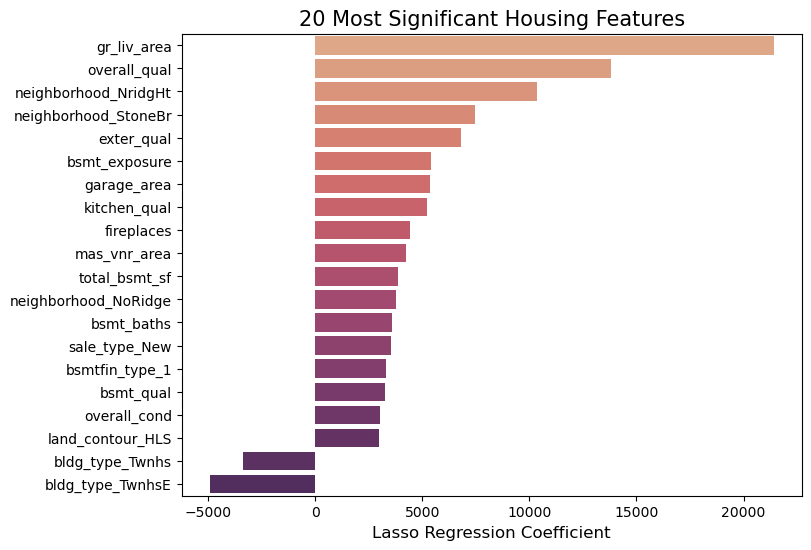

# Project 2 - Ames Housing Data and Kaggle Challenge

## Problem Statement

I represent a research team at [Zillow Group](https://career.zillowgroup.com/careers).  We are trying to develop a tool to determine the sale price of on-the-market homes in different urban centers in America.  We want to share this tool with our customers, and we want it to be specific enough and precise enough that we can offer it to them at a premium subscription price.  Our customers will benefit from having an accurate Real Estate Calculator because they can then know how to price their homes (as sellers) or what bids to offer (as buyers).  

From experience, we know that understanding the behavior of the national real-estate market is not specific enough and is difficult to model.  So for this project, we are going to focus on the urban center of Ames, Iowa.  We reached out to the Assessor's office, and they kindly shared their asset-evaluation [data](http://jse.amstat.org/v19n3/decock/DataDocumentation.txt).  We will use this data to build a model to predict the price of a new home sale.

We also want to identify which features impact the price (higher coefficients in the linear model) the most?  Are there any features which have a negative impact?

## Datasets

To analyze this problem, we are using housing data from the Assessor's office in Ames, Iowa.
 For modeling, I am using the train.csv file in the github repo under datasets/.
 Then I will run my model to predict the prices in the test.csv file and submit my prices by ID to Kaggle.

### Data Dictionary
This project comes with a very thorough data dictionary available [here](http://jse.amstat.org/v19n3/decock/DataDocumentation.txt).
 As I go through this project, I create a few new features, which I will describe below.
 I am not naming the various dummy columns created for the nominal values, because those are part of features described at the link.

**My Data Dictionary**

|Feature|Type|Description|
|---|---|---|
|outdoor_fin_sf|*float*|Total of all usable outdoor amenities (wood_deck, open_porch, enclosed_porch,'3ssn_porch',screen_porch,pool_area)|
|baths|*float*|Total of all baths above ground in the house (full_baths + (0.5xhalf_baths)|
|bsmt_baths|*float*|Total of all baths in the basement of the house (full_baths + (0.5xhalf_baths)|

## Exploratory Data Analysis

In this step, I created functions to generate plots of multiple features simultaneously.  It's alll a bit slow but it runs well and helps me see the histogram distributions, scatterplots against Price, as well as bar graphs against Price.

I found outliers for gr__liv_area and garage_yr_blt and removed them.
Then I analyzed all the features that contain nulls and determined these were referring to features that the home doesn't include, so these features can be imputed with either 0 or 'None'

Then created a correlation matrix comparing the numeric featues to 'saleprice'.  Found 4 variables that are collinear with other features, and decided to remove them too.

## Dataset Manipulation

1. Imputation: I decided on two strategies for null values
    * If n_nulls > 25%, drop the whole feature
    * Otherwise, fill the NA with 0 for numeric and str('None') for categorical
2. Feature Engineering
    * create new features that add up similar columns (for example, $baths = full_baths + 0.5half_baths$)
    * drop the columns that are now included in a different column
3. Ordinal Encoding
    * map {'Ex':2, 'Gd':1, 'TA':0, 'Fa':-1, 'Po':-2} in the ordinal list
    * if one of the categories is 'None', map 'None':0 and {'Ex','Gd','TA'} all increase by 1
    * number of columns doesn't change, so generate a new heatmap to see if there are more multi-collinearities
4. One Hot Encoding
    * create dummies (drop first) of the categorical features that cannot be processed by Ordinal Encoding
5. Standard Scaling
    * apply SS to all columns since they are all now numeric

## Modeling

### Metrics for evaluation

I will be returning the $R^2$ and $RMSE$ values for each model I generate.  

The default .score() for most of the LinearRegression models is $R^2$ and it's an easier metric to interpret: $X\%$ of the variance in the model can be explained by these features.

$RMSE$ is the metric on Kaggle, so if I track my RMSE's as well, I can check for variance between scoring my training set and the unseen test set.

### Comparing all the scores

|model|cross_val $R^2$|train $R^2$|val $R^2$|train RMSE (\$)|val RMSE (\$)|
| --- | --- | --- | --- | --- | --- |
baseline|NaN|NaN|-0.006|80726.0|73049.0
LinReg_final_features|-6.957780e+22|0.927|0.756|21831.0|35992.0
Ridge_final_features|0.864|0.900|0.811|25533.0|31643.0
**Lasso_final_features**|**0.854**|**0.895**|**0.822**|**26212.0**|**30691.0**
ElasticNet_final_features|0.865|0.901|0.811|25361.0|31703.0

The Lasso Regularization for my final set of features has the best balance of a high score and the lowest variance, but unfortunately the variance is still pretty high.  When I submitted my predictions to Kaggle, I got an RMSE of $29468.95$ which is a slightly better performance than the validation set, but not by much.  

### Testing Linear Assumptions

- [x] Linearity
- [x] Independence of errors
- [x] Normality
- [x] Equality of variance (homoscedasticity)
- [ ] No Multicollinearity (Indepedendence of predictors)

## Conclusions and Recommendations
Based on the metrics I chose for evaluation, the Lasso Regularization for my final set of features had the best results.  After submitting my predictions to Kaggle, I received an RMSE score of $29468.95$.  This is worse than my training RMSE score of $26212.0$, but the variance between them is minimized.  All my models scored much better than the baseline at an RMSE of $80726.0$. Therefore I can intuit that my thought process for building a LinearRegression model to predict Housing prices was logical.

The model is still overfitting to the training data, which is likely due to having so many features.  Even though Lasso regularized the features to reduce them from 183 to 73, it looks like it is still too many.

I also saw that there was a lot of multicollinearity (VIF calculation) left in my 183 features.  We could tinker with the model further by removing the worst offenders one by one and seeing how our score improves or not.

### Understanding the Coefficients

This is a great way to visualize the coefficients.  By themselves, the coefficients are a bit difficult to interpret because our features were standard scaled at the end.  So increasing the `gr_liv_area` by 1 square foot does *not* increase the price by \$21,000.  However, on this graph we can see which features have the biggest impact.  It's also sorted by absolute value first, so the two negative coefficients have a strong negative impact on price.

* Of the top 5, `gr_liv_area` has more than 3x the impact of `exter_qual`.  

* If you refer back to our correlation matrix in the EDA, the 5 numeric features with the highest correlation were `overall_qual`, `gr_liv_area`, `total_bsmt_sf`, `garage_area`, `garage_cars`.  Those initial predictions do sort of line up with what we see here.  They are all in the Top 20 shown in the graph above (except for `garage_cars` which we dropped due to pairwise correlation).

* The 'quality' features are strong indicators.  `overall_qual`, `exter_qual`, `kitchen_qual`, and `bsmt_qual` all show up.  This shows that qualitative information about the home can be just as useful to the buyers as quantitative measurements of area or number of fireplaces.

* We also see quite a few of the encoded nominal features in this graph.  Three neighborhoods show up \['Northridge Heights', Stone Brook, 'Northridge']. Cross-referencing [information](https://www.neighborhoodscout.com/ia/ames) about Ames neighborhoods does indicate that they are three of the wealthiest neighborhoods in Ames.

**What do our negative coefficients mean?**

* Once we understand our positive coefficients, we can understand that the negative coefficients indicate the opposite.  A home that exists as an end or inside unit of a townhouse will reduce the price, holding all else constant.  

### Recommendations

* We first recommend iterating and developing this model a bit further to see if we can get a more accurate predictor, especially with less variance. As it stands, we cannot currently recommend offering this as a subscription-based service, because it will not provide enough value to the customer yet. And it is not worth the time investment on our part if we cannot monetize it.
* As a short-term solution, we could build the model if we put caps on the price at either end.  This model does a decent job of predicting prices closer to the median, but the errors get bigger as we look at homes that are potentially either very expensive or very cheap.  Our model tends to underestimate very expensive homes, which could cause issues for a seller who loses money because they assess their home to a lower value than the true.

* We can make the following recommendations to a seller who wants to increase the value of their home before putting it on the market:
    * The total square feet of above-ground living area (sleeping/working/living) has the biggest impact on a home price.  If you have any areas in your home that are unfinished but have the potential to be livable (like an extra storage-only room for example), invest money in remodeling and making those spaces livable or usable beyond storage.
    * Overall quality of the finish and material of the house is another big indicator.  For example, if you have old-fashioned wood siding outside your home, consider getting it replaced by the more modern stucco siding.
    * Townhouses are some of the strongest *negative* indicators of price.  If you are unfortunately trying to sell a townhouse, definitely make sure to invest money where you can to increase the above-ground living area or improve the overall quality.  That effort will be necessary to get a good price on your sale.